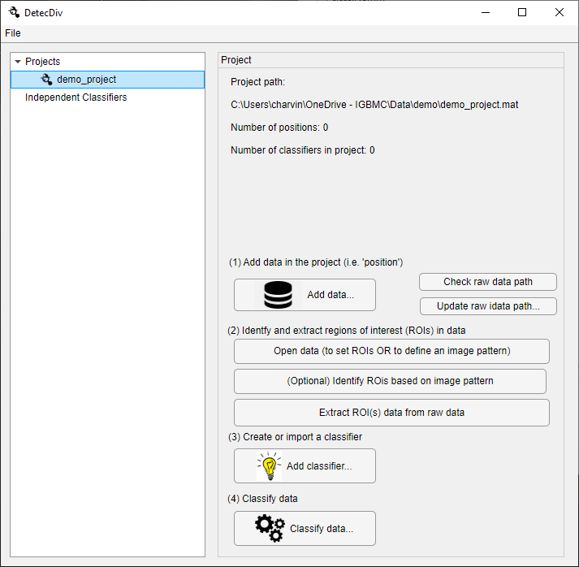
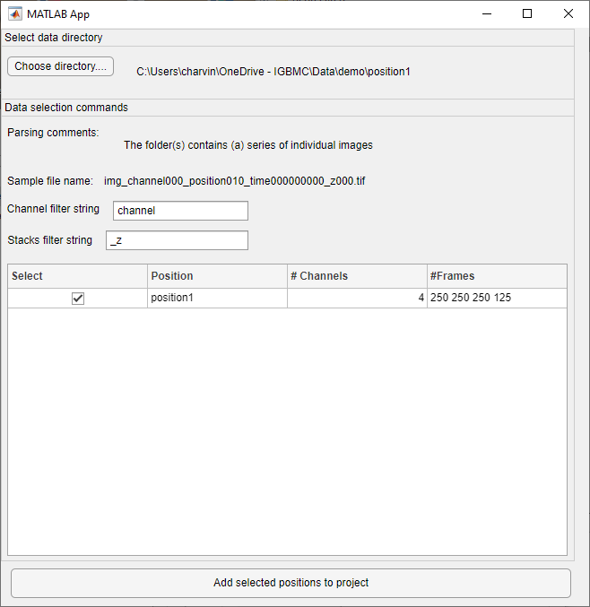

<div id="top"></div>


<!-- PROJECT LOGO -->
<br />
<div align="center">
  <a href="https://github.com/gcharvin/DetecDiv">
    
  </a>
  
  <h3 align="center"> DetecDiv - GUI user guide</h3>

</div>


## Table of contents

<!-- TABLE OF CONTENTS -->

 <!-- <summary>Table of Contents</summary> -->
  <ol>
    <li><a href="#gui_opening">Opening DetecDiv</a></li>
    <li><a href="#gui_project">Setting up a new project</a></li>
      <ul>
        <li><a href="#gui_project_new">New project</a></li>
        <li><a href="#gui_project_save">Saving project</a></li>
        <li><a href="#gui_project_data">Adding data</a></li>
      </ul>
    <li><a href="#roi">Defining and using regions of interests (ROIs)</a></li>
   <ul>
        <li><a href="#roi_manual">Manually adding ROIs</a></li>
        <li><a href="#roi_automated">Automated detection of multi ROIs</a></li>
        <li><a href="#roi_extraction">Exctracting 4-D volumes</a></li>
    </ul>
    <li><a href="#contact">Contact</a></li>
    <li><a href="#acknowledgments">Acknowledgments</a></li>
  </ol>


<div id="gui_opening"></div>

## Opening DetecDiv ##

Type in Matlab workspace: 

```>> detecdiv```

DetecDiv main window:


<p align="right">(<a href="#top">back to top</a>)</p>

<div id="gui_project"></div>

## Setting up a new project  ##

<div id="gui_project_new"></div>

### New project:  

File --> New Project --> Choose filename/location 

<div id="gui_project_save"></div>

### Saving a project 

File --> Save Project 

Please note that a corresponding variable associated with the project is listed in the workspace. 
This variable can be accessed at any time to gather information, include as an argument in your own scripts, 
or use additional command-line functions of DetecDiv.

<div id="gui_project_data"></div>

### Adding data: 

Click on the project name in the tree window: 



Select --> Add data...


The addData GUI can parse files and folders with different formats according to specific rules, see below. 
Choose a directory that contains either: 
1) a list of files corresponding to one microscope field-of-view that contains all channels, timepoints and stacks data. 
Filters may used to parse channels and stacks from the names of the files.
2) a list of multi-tif files (each multi-tif file will considered as one field of view and must contain relevant information to parse the different channels, time points etc). 
3) a PhyloCell project .mat file (and dependent folders).

Example of file list parsing :



Example of multi-tiff files parsing :


Click --> Add selected positions to project
Click --> Close

Information about the position added is available in the tree window by expanding the project node:


WARNING : Save the project at this point. If not, any modification would be lost upon closing the project. For this, click File --> Save selected project

<p align="right">(<a href="#top">back to top</a>)</p>

<div id="roi"></div>

## Defining and using regions of interests (ROIs)  ##

<div id="roi_manual"></div>

### Manually adding ROIs ###

Select a project in the tree window.

Right-click on a position node and click : --> Open position...
This will load a window with raw images of all available channels as a series of grayscale images. You can scroll through time by using left and right keyboard arrows.


Disable all channels but channel #1 by unchecking the corresponding boxes in the 'Channel' menu. 
To define an ROI, zoom and pan on the desired area by selecting Matlab tools on the top-right corner of the image.
With the pan or zoom tool still selected, right click on the image to refine the region of interest by either:
1) manually adjusting the window position: --> switch to pan mode
2) adjusting the dimensions of the ROI: --> Adjust current zoom... ; In this case, set up the numbers that correspond to : [ x y width height]

Once the ROI is OK, right-click : --> Add current ROI
Then click: --> Reset zoom ; The ROI is now represented in red on the raw image
Deselect the zoom or pan MATLAB tools : you can now select the ROI of interest (it appears in yellow) and further adjust ROI parameters. 
Repeat these operation to create as many ROIs as necessary
Close the the Figure window when done

<div id="roi_automated"></div>

<div id="roi_extraction"></div>

<!-- MARKDOWN LINKS & IMAGES -->
<!-- https://www.markdownguide.org/basic-syntax/#reference-style-links -->
[contributors-shield]: https://img.shields.io/github/contributors/gcharvin/DetecDiv
[contributors-url]: https://github.com/gcharvin/DetecDiv/graphs/contributors
[forks-shield]: https://img.shields.io/github/forks/gcharvin/DetecDiv
[forks-url]: https://github.com/gcharvin/DetecDiv/network/members
[stars-shield]: https://img.shields.io/github/stars/gcharvin/DetecDiv
[stars-url]: https://github.com/gcharvin/DetecDiv/stargazers
[issues-shield]: https://img.shields.io/github/issues/gcharvin/DetecDiv
[issues-url]: https://github.com/gcharvin/DetecDiv/issues
[license-shield]: https://img.shields.io/github/license/gcharvin/DetecDiv
[license-url]: https://github.com/gcharvin/DetecDiv/blob/master/LICENSE.txt
[product-screenshot]: images/screenshot.png


