<div id="top"></div>


<!-- PROJECT LOGO -->
<br />
<div align="center">
  <a href="https://github.com/gcharvin/DetecDiv">
    
  </a>
  
  <h3 align="center"> DetecDiv - GUI user guide</h3>

</div>


## Table of contents

<!-- TABLE OF CONTENTS -->

 <!-- <summary>Table of Contents</summary> -->
  <ol>
    <li><a href="#gui_opening">Opening DetecDiv</a></li>
    <li><a href="#gui_project">Setting up a new project</a></li>
      <ul>
        <li><a href="#gui_project_new">New project</a></li>
        <li><a href="#gui_project_save">Saving project</a></li>
        <li><a href="#gui_project_data">Adding data</a></li>
      </ul>
    <li><a href="#roi">Defining and using regions of interests (ROIs)</a></li>
   <ul>
        <li><a href="#roi_manual">Manually adding ROIs</a></li>
        <li><a href="#roi_automated">Automated detection of multi ROIs</a></li>
        <li><a href="#roi_extraction">Exctracting 4-D volumes</a></li>
        <li><a href="#roi_browse">Browsing ROIs data</a></li>
    </ul>
   <li><a href="#classi">Creating and setting up a classifier</a></li>
   <ul>
        <li><a href="#classi_new">Creating a new classifier within a project</a></li>
        <li><a href="#classi_import">Importing an exisiting classifier</a></li>
    </ul>
   <li><a href="#classi_edit">Editing a classifier</a></li>
   <li><a href="#classify">Classifying new data</a></li>
  </ol>


<div id="gui_opening"></div>

## Opening DetecDiv ##

Type in Matlab workspace: 

```>> detecdiv```

DetecDiv main window:


<p align="right">(<a href="#top">back to top</a>)</p>

<div id="gui_project"></div>

## Setting up a new project  ##

<div id="gui_project_new"></div>

### New project:  

File --> New Project --> Choose filename/location 

<p align="right">(<a href="#top">back to top</a>)</p>

<div id="gui_project_save"></div>

### Saving a project 

File --> Save Project 

Please note that a corresponding variable associated with the project is listed in the workspace:

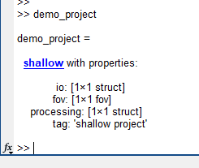

This variable can be accessed at any time to gather information, include as an argument in your own scripts, 
or use additional command-line functions of DetecDiv.

<p align="right">(<a href="#top">back to top</a>)</p>

<div id="gui_project_data"></div>

### Adding data: 

Click on the project name in the tree window: 


Select --> Add data...


The addData GUI can parse files and folders with different formats according to specific rules, see below. 
Choose a directory that contains either: 
1) a list of files corresponding to one microscope field-of-view that contains all channels, timepoints and stacks data. 
Filters may used to parse channels and stacks from the names of the files.
2) a list of multi-tif files (each multi-tif file will considered as one field of view and must contain relevant information to parse the different channels, time points etc). 
3) a PhyloCell project .mat file (and dependent folders).

Example of file list parsing :


Example of multi-tiff files parsing :


Click --> Add selected positions to project
Click --> Close

Information about the position added is available in the tree window by expanding the project node:


WARNING : Save the project at this point. If not, any modification would be lost upon closing the project. For this, click File --> Save selected project

<p align="right">(<a href="#top">back to top</a>)</p>

<div id="roi"></div>

## Defining and using regions of interests (ROIs)  ##

<div id="roi_manual"></div>

### Manually adding ROIs ###

Select a project in the tree window.

Right-click on a position node and click : --> Open position...
This will load a window with raw images of all available channels as a series of grayscale images. You can scroll through time by using left and right keyboard arrows.
Disable all channels but channel #1 by unchecking the corresponding boxes in the 'Channel' menu. 

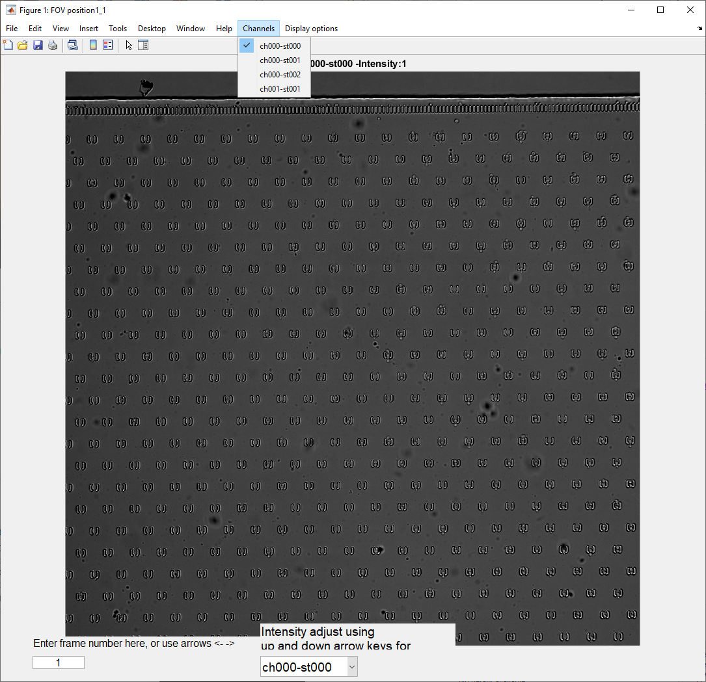

To define an ROI, zoom and pan on the desired area by selecting Matlab tools on the top-right corner of the image.
With the pan or zoom tool still selected, right click on the image to refine the region of interest by either:
1) manually adjusting the window position: --> switch to pan mode
2) adjusting the dimensions of the ROI: --> Adjust current zoom... ; In this case, set up the numbers that correspond to : [ x y width height]

Once the ROI is OK, right-click : --> Add current ROI


Then click: --> Reset zoom ; The ROI is now represented in red on the raw image:

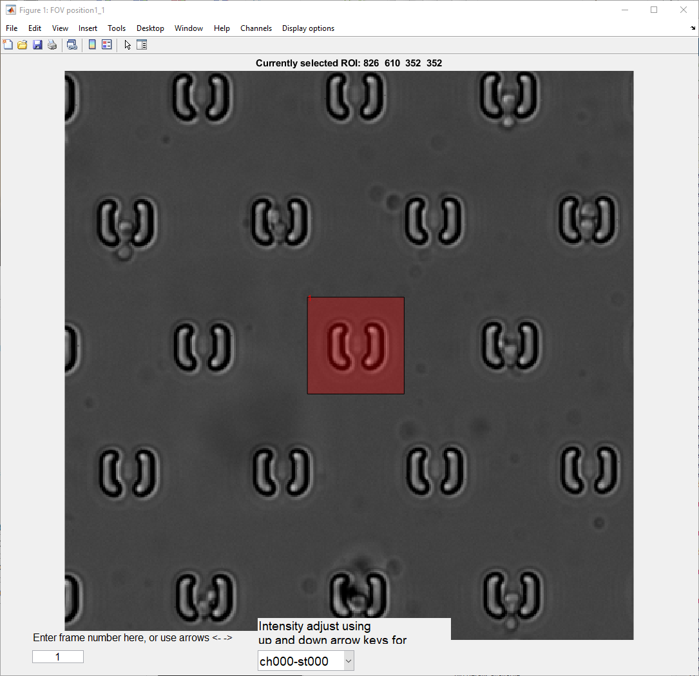

Deselect the zoom or pan MATLAB tools : you can now select the ROI of interest (it appears in yellow) and further adjust ROI parameters:


Repeat these operations to create as many ROIs as necessary.
Close the the Figure window when done.

<p align="right">(<a href="#top">back to top</a>)</p>

<div id="roi_automated"></div>

### Automated detection of multiple ROIs (e.g. cell traps detection) ###

First, manually set an ROI as described above.

Select the ROI, right-click --> Select the ROI as reference pattern; The contours of the ROI become bold.

(Optional) Specify a "cropping area" that will discard any detect ROI outside of the cropping area:
For this, click --> Set/show cropping area in the 'Display Options' menu and draw a polygon correspinding to the desired area:

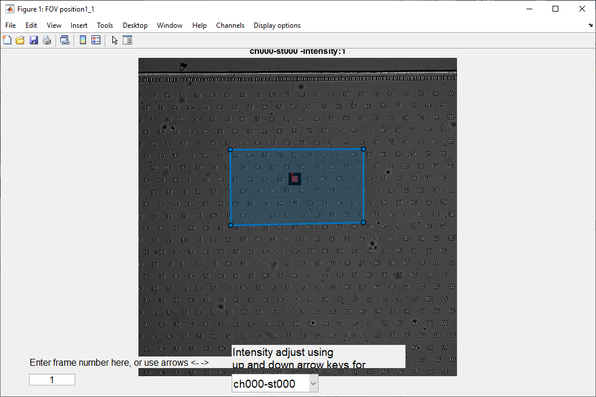

Right-click on the cropping area to hide or delete it.
Close the figure window. 

In detecdiv, select a position and click --> identify ROIs based on image pattern; this launches the ROI identification GUI. 
The GUI displays an image of the selected pattern:

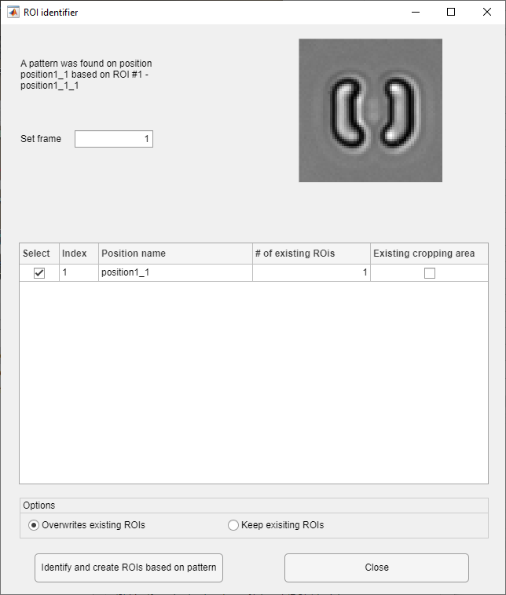

You can change the pattern by changing the frame used to generate it: --> Set frame edit field (default frame is the first frame).
Select all the positions to be processed with this selected pattern. A cropping area will be used if one has been defined above.

Choose --> Overwrites existing ROIs (deletes the manually defined ROIs, but keeps the detection pattern) or --> Keep existing ROIs  (preserves the existing ROIs)

Click --> Identify and create ROIs based on pattern; Once the detection is complete, the number of ROIs detected is updated in the table for each position 
Close the ROI identifer GUI.

You can now see the avaiable ROIs as subnodes of the position nodes:

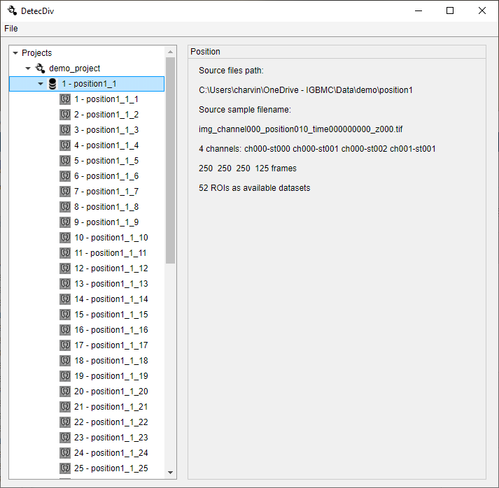

You can also look at the spatial location of these ROIs by opening the position window (right-click on a selected position, as described previously):

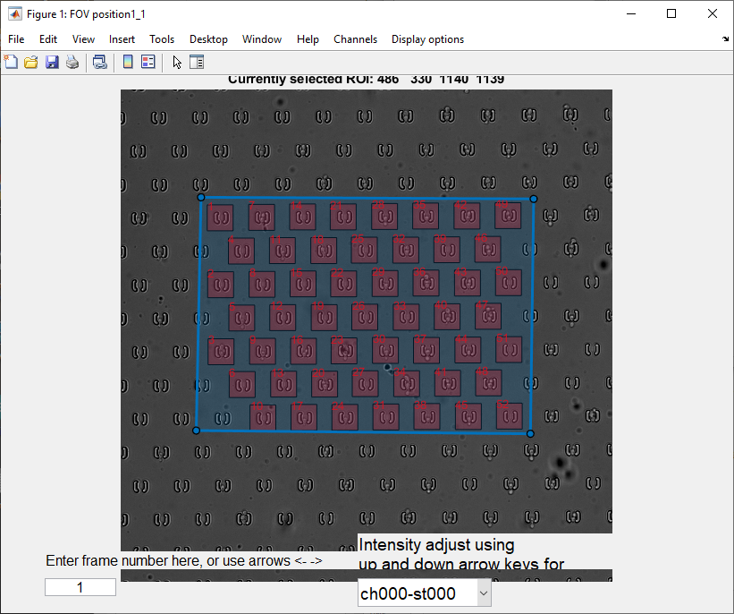

WARNING: Save the project at this time.


<p align="right">(<a href="#top">back to top</a>)</p>

<div id="roi_extraction"></div>

### Extracting 4-D volumes for ROIs in positions ###

Once defined, ROIs data can be extracted by creating individual .mat files that contains (X,Y,Channel,Time) information.

Select a relevant project and position by navigating the tree window.

Click: --> Extract ROIs data from raw data

Select parameters: 

-Array of frames 

-Array of positions to be processed

-Max number of frames loaded in memory (this is is to prevent loading all the raw images at once during this process).

-Channel-specific relative frame interval: If channel 1 is snapped every 5min and channel 2 is snapped every 10 minutes, then type 1 2.
(The data parsing program attempts to guess this paramter by counting the respective number of files for each channel).

Confirm your choice. 

This process takes a very long time. It uses parallel computing to distribute computing tasks on different workers.
Information in the workspace is indicated to show the progression of the process. The project is automatically saved at the end of the process.

<p align="right">(<a href="#top">back to top</a>)</p>

<div id="roi_browse"></div>

### Browsing ROI data ###

Once extracted, ROIs data can be viewed by left-clicking on subnodes of the position nodes in the tree window. 
A figure window will appear, allowing to select the channels to be displayed. Use keyboard arrow keys to scroll trhough time. 


<p align="right">(<a href="#top">back to top</a>)</p>

<div id="classi"></div>

## Creating and setting up a classifier ##

<div id="classi_new"></div>

### Creating a new classifier within a project ###

Select the project of interest in the tree window.

Click --> add Classsifier.

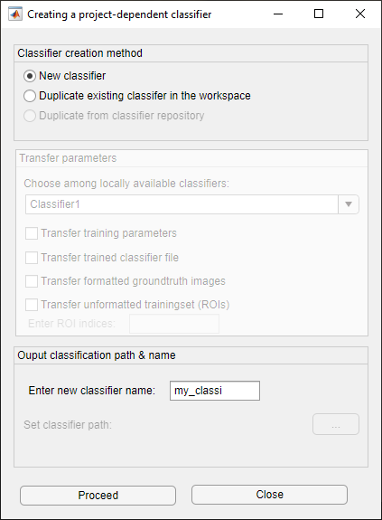

Select "New Classifier".
Enter the name of the classifier and click --> Proceed.
WARNING : save project at this time.

<div id="classi_import"></div>

### Importing an exisiting classifier ###

If a classifier is loaded in the workspace (either a project-based or project-independent classifier), you can transfer it to your own project.
Select the project of interest in the tree window.

Click --> add Classsifier.


Select "Duplicate existing classifier in the workspace". In the dropdown list, select the desired classifier.

Check which aspect of the classifier should be transferred:

- training parameters (hyperparameters used by the training procedure)

- the file that contains the trained classifier (which can be used right away without further training)

- formatted groundtruth images that can be used to train/re-train the classifier

- the trainingset (i.e. a list of ROIs that have been manually annotated and are used to generate the groundtruth image dataset). In this case, please specfiy the array of ROIs to be transferred.
- 
Enter the name of the new classifier and click --> Proceed.
WARNING : save project at this time.

<p align="right">(<a href="#top">back to top</a>)</p>

<div id="classi_edit"></div>

## Editing a classifier ##

Once a classifier is created, dependent ROIs (if any) are listed as subnodes of the classifier node. They can be open by left-clicking the corresponding nodes:

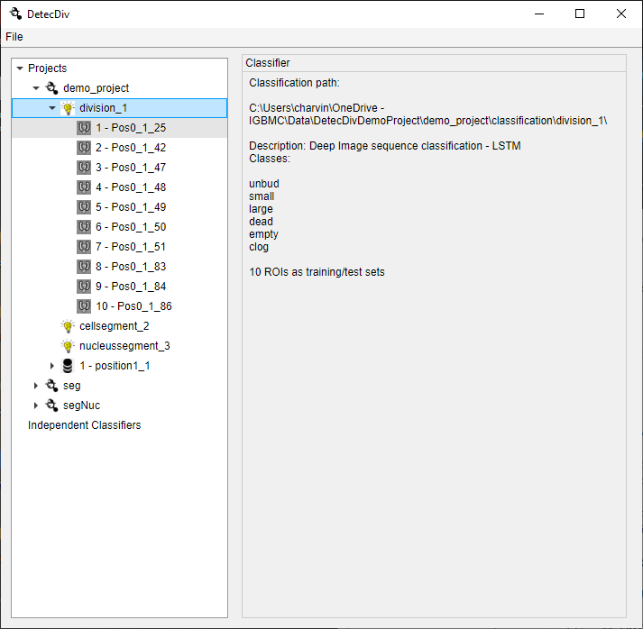

To edit a classifier: 
Right-click on a classifier --> Open classifier.

The classifier GUI has 3 tabs to allow paramters setup:
 1) classification parameters; Please entrer information as requested (MORE ON THIS TO FOLLOW SOON)


 2) Training procedure parameters; Enter parameter values in the table (MORE ON THIS TO FOLLOW SOON)

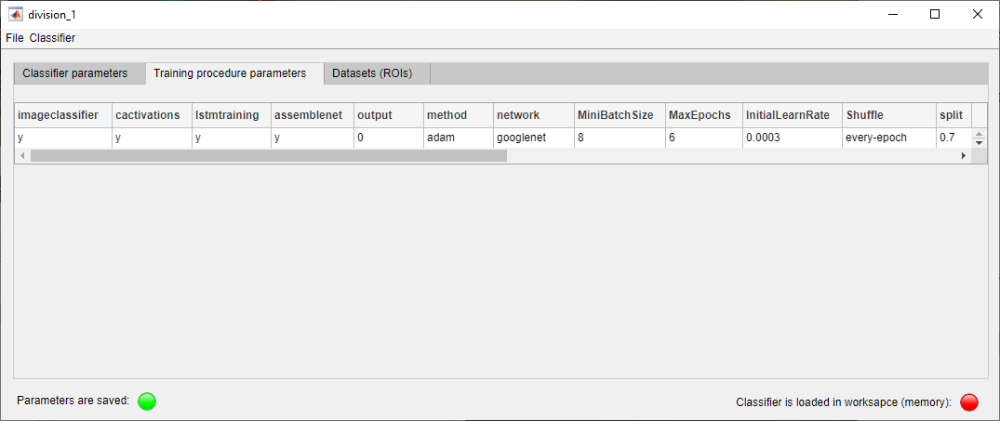

 3) ROIs used as trainingset or testset.

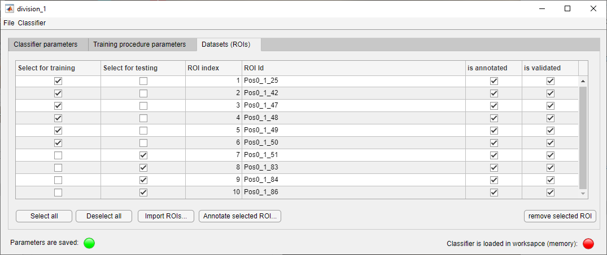

Specific buttons on this tab: 

	*Select/Delect ROIs: Select/Unselect the ROIs to be used as training set (network training) or, alternatively, as a test set (validation)
	*Import ROIs: Additional ROIs can be imported from other ROIs available in the workspace.
	*Annotate selected ROI : launches a figure window to perofmr manual annotation of the training/test sets. Shortcut keys indicated in the "Classes" menu can be used to assign one among all available classes for each frame. 
 
The buttons at the bottom provide the following functions:
* Save classifier & parameters: saves all relevant paramters in the classfier GUI. This step is required to preserve any modification executed in the GUI
* Format trainingset for training : this function exports ROIs data as images to folders. These images will be then used by the training procedure
* Train classifier : launches the training procedure 
* Validateclassifier : classify all the ROI data in the classifier GUI using the trained network (if any). 
* Display statistics: performs the validation of the classifier by comparing predictions and groundtruth for the testset only (i.e. input training data are not considered to compute statistics)


<p align="right">(<a href="#top">back to top</a>)</p>

<div id="classify"></div>

## Classifying new data ##

Click --> Classify data after seelcting a project in the tree window. 


In the classify data GUI: 
* Select a classifier
* Select positions and ROIs to be processed in the table window. You can also edit the channel in the ROIs to be used as input of the classifier. By default, the channel value is identical to that used for training the classifier. 
Classification can take a very long time depending on the size of the dataset. Classification results are automatically saved.

Once finished, classified data can be monitored by left-clicking ROIs in Project->Position subnodes:


<p align="right">(<a href="#top">back to top</a>)</p>


<!-- MARKDOWN LINKS & IMAGES -->
<!-- https://www.markdownguide.org/basic-syntax/#reference-style-links -->
[contributors-shield]: https://img.shields.io/github/contributors/gcharvin/DetecDiv
[contributors-url]: https://github.com/gcharvin/DetecDiv/graphs/contributors
[forks-shield]: https://img.shields.io/github/forks/gcharvin/DetecDiv
[forks-url]: https://github.com/gcharvin/DetecDiv/network/members
[stars-shield]: https://img.shields.io/github/stars/gcharvin/DetecDiv
[stars-url]: https://github.com/gcharvin/DetecDiv/stargazers
[issues-shield]: https://img.shields.io/github/issues/gcharvin/DetecDiv
[issues-url]: https://github.com/gcharvin/DetecDiv/issues
[license-shield]: https://img.shields.io/github/license/gcharvin/DetecDiv
[license-url]: https://github.com/gcharvin/DetecDiv/blob/master/LICENSE.txt
[product-screenshot]: images/screenshot.png


